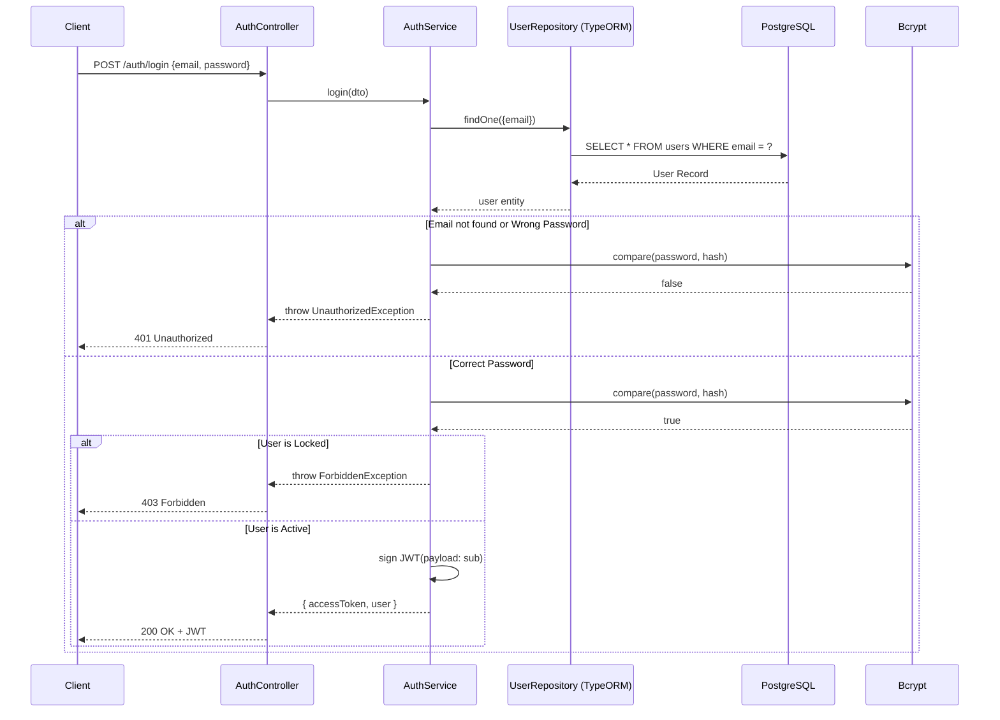
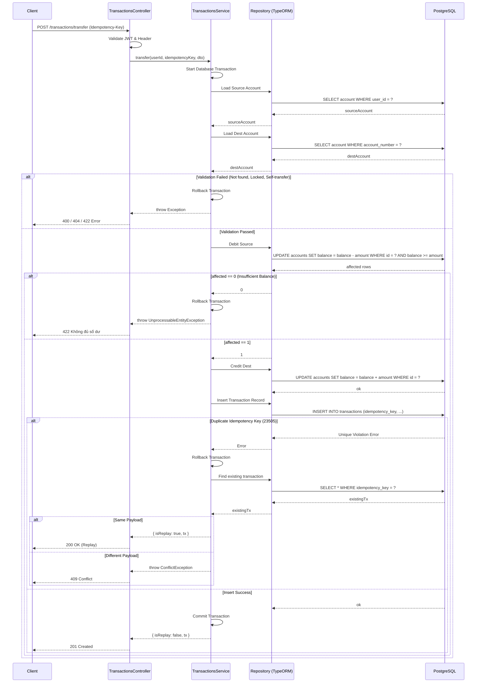

# Sequence Diagrams

## 1. Authentication Flow (Login)

```mermaid
sequenceDiagram
    participant Client
    participant Controller as AuthController
    participant Service as AuthService
    participant Repo as UserRepository (TypeORM)
    participant DB as PostgreSQL
    participant Bcrypt

    Client->>Controller: POST /auth/login {email, password}
    Controller->>Service: login(dto)
    Service->>Repo: findOne({email})
    Repo->>DB: SELECT * FROM users WHERE email = ?
    DB-->>Repo: User Record
    Repo-->>Service: user entity
    
    alt Email not found or Wrong Password
        Service->>Bcrypt: compare(password, hash)
        Bcrypt-->>Service: false
        Service-->>Controller: throw UnauthorizedException
        Controller-->>Client: 401 Unauthorized
    else Correct Password
        Service->>Bcrypt: compare(password, hash)
        Bcrypt-->>Service: true
        
        alt User is Locked
            Service-->>Controller: throw ForbiddenException
            Controller-->>Client: 403 Forbidden
        else User is Active
            Service->>Service: sign JWT(payload: sub)
            Service-->>Controller: { accessToken, user }
            Controller-->>Client: 200 OK + JWT
        end
    end
```

## 2. Transfer Flow (Chuyển khoản nội bộ)

```mermaid
sequenceDiagram
    participant Client
    participant Controller as TransactionsController
    participant Service as TransactionsService
    participant Repo as Repository (TypeORM)
    participant DB as PostgreSQL

    Client->>Controller: POST /transactions/transfer (Idempotency-Key)
    Controller->>Controller: Validate JWT & Header
    Controller->>Service: transfer(userId, idempotencyKey, dto)
    
    Service->>Service: Start Database Transaction
    
    Service->>Repo: Load Source Account
    Repo->>DB: SELECT account WHERE user_id = ?
    DB-->>Repo: sourceAccount
    Repo-->>Service: sourceAccount

    Service->>Repo: Load Dest Account
    Repo->>DB: SELECT account WHERE account_number = ?
    DB-->>Repo: destAccount
    Repo-->>Service: destAccount

    alt Validation Failed (Not found, Locked, Self-transfer)
        Service->>Service: Rollback Transaction
        Service-->>Controller: throw Exception
        Controller-->>Client: 400 / 404 / 422 Error
    else Validation Passed
        Service->>Repo: Debit Source
        Repo->>DB: UPDATE accounts SET balance = balance - amount WHERE id = ? AND balance >= amount
        DB-->>Repo: affected rows
        
        alt affected == 0 (Insufficient Balance)
            Repo-->>Service: 0
            Service->>Service: Rollback Transaction
            Service-->>Controller: throw UnprocessableEntityException
            Controller-->>Client: 422 Không đủ số dư
        else affected == 1
            Repo-->>Service: 1
            Service->>Repo: Credit Dest
            Repo->>DB: UPDATE accounts SET balance = balance + amount WHERE id = ?
            DB-->>Repo: ok
            
            Service->>Repo: Insert Transaction Record
            Repo->>DB: INSERT INTO transactions (idempotency_key, ...)
            
            alt Duplicate Idempotency Key (23505)
                DB-->>Repo: Unique Violation Error
                Repo-->>Service: Error
                Service->>Service: Rollback Transaction
                Service->>Repo: Find existing transaction
                Repo->>DB: SELECT * WHERE idempotency_key = ?
                DB-->>Repo: existingTx
                Repo-->>Service: existingTx
                alt Same Payload
                    Service-->>Controller: { isReplay: true, tx }
                    Controller-->>Client: 200 OK (Replay)
                else Different Payload
                    Service-->>Controller: throw ConflictException
                    Controller-->>Client: 409 Conflict
                end
            else Insert Success
                DB-->>Repo: ok
                Service->>Service: Commit Transaction
                Service-->>Controller: { isReplay: false, tx }
                Controller-->>Client: 201 Created
            end
        end
    end
```